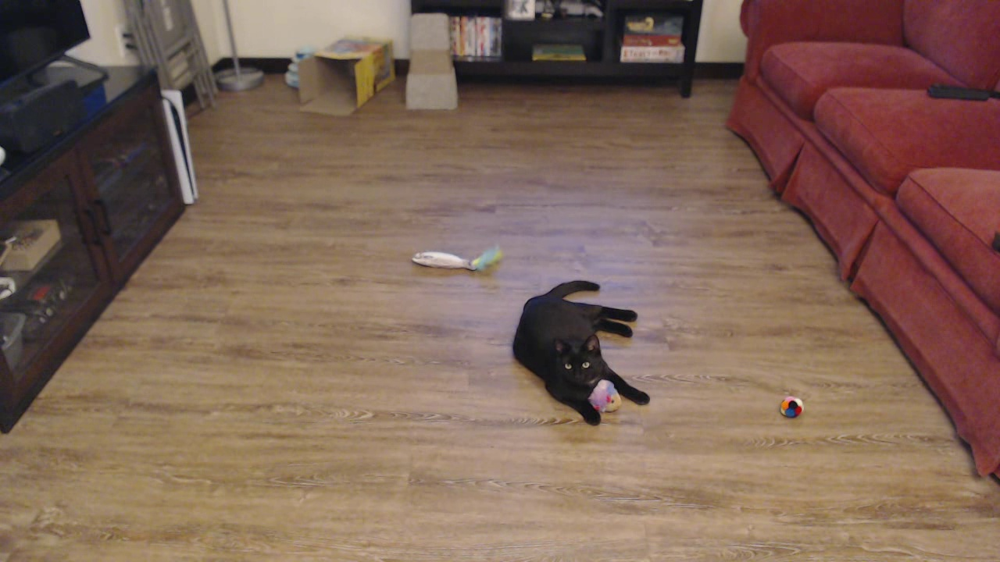
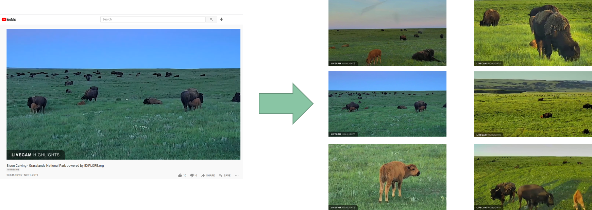

# Summary
This repository contains Python scripts for working with image datasets for machine learning object detection models. It contains the following scripts (more may be added later):

1. [PictureTaker](#picturetaker)
1. [FrameGrabber](#framegrabber)
2. [AutoLabeler](#autolabeler)

A brief description of each script is given below. The scripts themselves are in their own folders in this repository. The README.md file in each folder gives instructions on how to use the script.

## PictureTaker
[PictureTaker](https://github.com/EdjeElectronics/Image-Dataset-Tools/tree/main/PictureTaker) is a simple Python script for taking pictures with OpenCV and a connected camera. It makes it easy to collect images for training a machine learning vision model.

   

## FrameGrabber
[FrameGrabber](https://github.com/EdjeElectronics/Image-Dataset-Tools/tree/main/FrameGrabber) is a tool for extracting individual frames from a video and saving them as an image. It allows you to quickly create training images from a video of objects that you want to train your model to detect.

   

This can be useful for building a training dataset by recording or finding videos of objects you want to detect. Then you can extract hundreds or thousands of images from the videos, and label them for training.

## AutoLabeler
[AutoLabeler](https://github.com/EdjeElectronics/Image-Dataset-Tools/tree/main/AutoLabeler) is a tool for automatically labeling images using a model trained off only a small portion of your full dataset. You start by training a model with only a subset of the images (say, 10% of them), and then using that model to label the remaining immages. It automatically saves a label data file for each image. As it labels images, you supervise the labels to make sure they look correct. If a label is incorrect, you reject the label and manually label it yourself. 

   

While you still have to manually accept or reject each label, it saves signficant time over labeling every image yourself. It can be a useful approach if you have over 1,000 images that need to be labeled. You can also stop and re-train the model during the process (say, after 25% of the images are labeled) to make it more accurate at labeling images.
